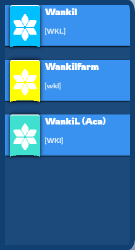

# Whiteout Interactive Map – Presentation

Welcome to the presentation of the **Whiteout Interactive Map** project!  
This document provides an overview of the application's main features, user interface, and usage, with visual examples.

---

## Table of Contents

1. [Project Overview](#project-overview)
2. [Main Features](#main-features)
3. [Screenshots](#screenshots)
4. [How It Works](#how-it-works)
5. [API Integration](#api-integration)
6. [Credits](#credits)

---

## Project Overview

Whiteout Interactive Map is a full-stack web application that allows users to explore, interact with, and manage map data dynamically.  
It is built with Node.js, Express, MongoDB, and a modern frontend framework.

---

## Main Features

- Interactive map interface for exploring locations and buildings.
- Add, edit, and view buildings or points of interest.
- RESTful API for CRUD operations.
- User authentication (basic, no roles yet).
- Dockerized for easy deployment.

---

## Screenshots

> _Replace the image paths with your actual image files in the `docs/assets/` folder._

### Home Page

### Map View

---

## How It Works

1. **Explore the Map:**  
   Users can pan, zoom, and click on map elements to view details.

   

2. **Manage Locations:**  
   Add or edit buildings and points of interest directly from the UI.

   

---

## Additional Features

- **Localization:**  
    The application supports multiple languages, allowing users to interact with the map in their preferred language.

    

- **Player Power & Ralliement Values:**  
    Track player power and ralliement (rally) values to assist with event preparation and strategic planning.

    

- **Multiple Alliances:**  
    Users can manage different alliances, such as a main alliance, farm alliance, and academy, for better organization and coordination.  
    _Note: For now, alliance management is hard-coded and not dynamically configurable._

    

## Credits

Developed by Krozac.  
For more information, see the [README.md](../README.md).

---